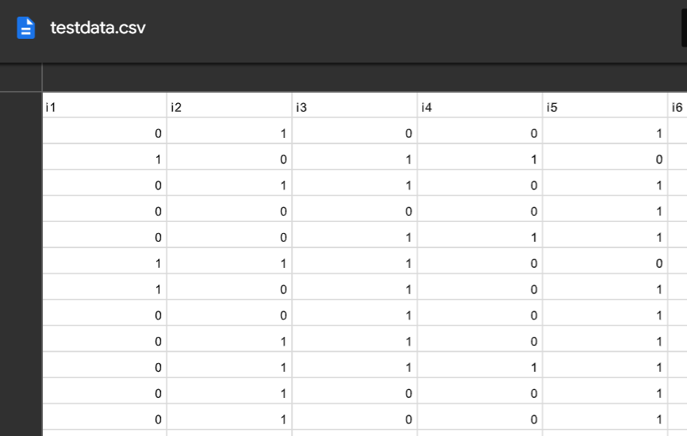

# ctticc

Item characteristic curves (ICC's) are visual indicators of important attributes of assessment items - most commonly *difficulty* and *discrimination*. Assessment specialists who examine ICC's usually do so from within the psychometric framework of either Item Response Theory (IRT) or Rasch modeling. This `R` package provides an extension of this tradition into the Classical Test Theory (CTT) framework. The package has `psych` and `ggplot2` dependencies that facilitate the estimation of CTT-generated difficulty (_pseudob_) and discrimination (_pseudoa_) "parameters", and then plots the ICCs. 

A nice summary of how to interpret IRT parameters is located here: https://wnarifin.github.io/simpler/irt_2PL.html

|   Quick Links  |
|:-------|
| [**Example Data**](https://github.com/MontclairML/ctticc#Example-data) |
| [**How to Use**](https://github.com/MontclairML/ctticc#How-to-use) |
| [**Future Advancements**](https://github.com/MontclairML/ctticc#Future-advancements) |

## Example Data

| `testdata.csv` | `dataset2` | `possibly 3?` |
|:---------------:|:---------------------:|:---------------------:|
| |  |  |
|binary responses with missing values (25 items and 10,000 respondents)||| 

## How to Use

To install from GitHub use `devtools::install_github("MontclairML/ctticc")`. 

Next, load the package via `library(ctticc)`

The function specification is:

ctticc(dataframe,items,plot)

The `dataframe` should contain binary responses.

The `items` field indicates which columns should be included in the analysis.

`plot` is logical with values of `TRUE` or `FALSE`.

## Future Advancements

Please feel free to give us feedback or requests for changes.
