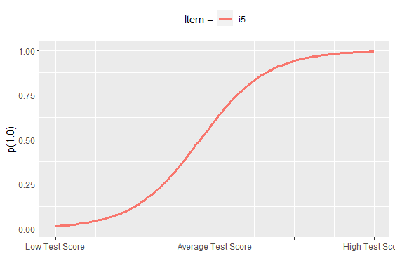
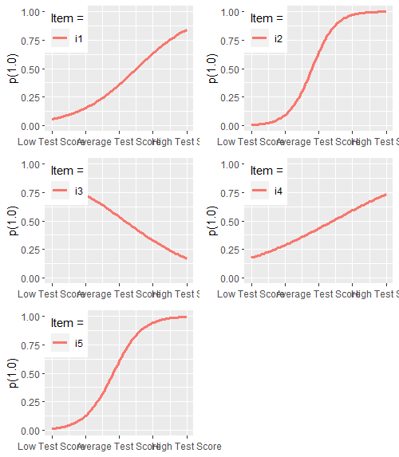

# ctticc

Item characteristic curves (ICC's) are visual indicators of important attributes of assessment items - most commonly *difficulty* and *discrimination*. Assessment specialists who examine ICC's usually do so from within the psychometric framework of either Item Response Theory (IRT) or Rasch modeling. This `R` package provides an extension of this tradition into the Classical Test Theory (CTT) framework. The package has a `psych` dependency that facilitate the estimation of CTT-generated difficulty (_pseudob_) and discrimination (_pseudoa_) "parameters" from a `psych::alpha` object, and then plots the ICCs. 

A handy compilation of how to interpret IRT parameters is [located here](https://wnarifin.github.io/simpler/irt_2PL.html).

|   Quick Links  |
|:-------|
| [**Plot Screenshots**](https://github.com/MontclairML/ctticc#Plot-Screenshots) |
| [**How to Use**](https://github.com/MontclairML/ctticc#How-to-use) |
| [**Future Advancements**](https://github.com/MontclairML/ctticc#Future-advancements) |

## Plot Screenshots

| `separate` | `grid` | `together` |
|:---------------:|:---------------------:|:---------------------:|
| |  |  

## How to Use

To install from GitHub use `devtools::install_github("MontclairML/ctticc")`. 

Next, load the package via `library(ctticc)`

The function specification is:

`ctticc(dataframe,items,plot)`

The `dataframe` should contain binary responses.

The `items` field indicates which columns should be included in the analysis. Use the concatenate function (e.g., `c()`) if you'd like to specify non-sequantial items (for example, `c(1,4,7)`) would present ICCs for data columns 1, 4, and 7.

`plot` has values of `grid`, `separate`, or `together`. If using the `grid` specification, you will also need to specify nrow and ncol (for example, the screenshot reflected values of `3` and `2`).

## Future Advancements

We may add a "pseudo" Test Information Function. Please also give us  feedback and requests for additions or changes.
