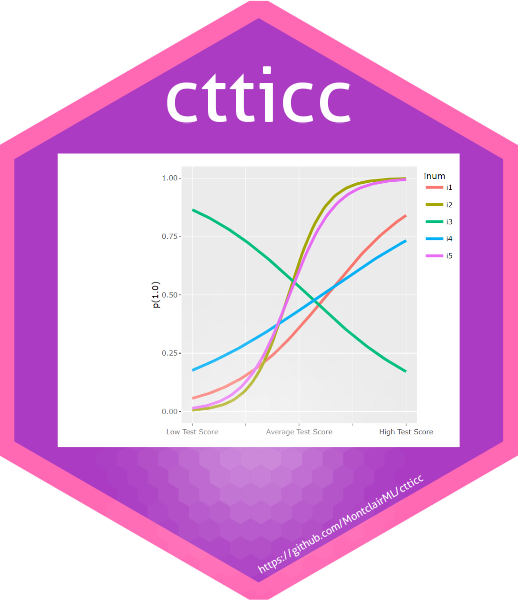

```{r setup, include=FALSE}
options(htmltools.dir.version = FALSE)
```


.pull-left[# `ctticc`: Visualizing Test Item Characteristics 
### [Diego Figueiras](https://github.com/MontclairML) <br>& [John Kulas](https://github.com/jtkulas)
]



---
class: inverse, left, top

# Description of package

.pull-left[`ctticc` produces visual item characteristic curves from classic test statistics used in classroom applications.

+ Simple inputs are: 
  + *p*-values
  + corrected item total correlations
  
Test administrators recieve feedback regarding item performance:
]

.pull-right[
```{r plot2, echo=FALSE, message=FALSE, warning=FALSE}

ctticc<-function(data, item, plot="together", nrow=2, ncol=3){
  library(psych)
  library(ggplot2)
  library(gridExtra)
  library(tidyverse)
  library(plotly)
  pseudob<-data.frame(qnorm(colMeans(data, na.rm=TRUE)))*-1 #CALCULATING THE CTT-B PARAMETER, WHICH IS JUST THE PROBABILITIES OF ANSWERING RIGHT FOR EACH ITEM.
  ahat<-function(x){
    r<-(((2.71828)^x)-(1/(2.71828)^x))/(2.71828-(2.71828)^x)

    ((((0.51+(0.02*abs(pseudob))+(0.301*pseudob^2))*x)+((0.57-(0.009*abs(pseudob))+(0.19*pseudob^2))*r))*1.71633) ## 1.71633

  }#FUNCTION TO ESTIMATE THE CTT-A STATISTIC, WHICH IS THE EQUIVALENT TO THE DISCRIMINATION STATISTIC IN IRT


  alphas<-psych::alpha(data, check.keys = FALSE, warnings=FALSE)                #COMPUTING ALPHAS FOR ALL 100 ITEMS. WE NEED THIS IN ORDER TO GET THE CORRECTED ITEM-TOTAL CORRELATIONS, WHICH WE THEN USE FOR COMPUTING THE CTT-A STATISTIC.
  citcs<-data.frame(alphas$item.stats$r.drop)                  #ACCESSING THE CORRECTED ITEM-TOTAL CORRELATIONS INSIDE alphas.
  pseudoA<-data.frame(ahat(citcs))                             #USING THE ahat FUNCTION TO CALCULATE THE CTT-A PARAMETER FOR ALL 100 ITEMS. CORRECTED ITEM-TOTAL CORRELATION ARE ENTERED AS AN ARGUMENT.
  pseudoB<- -0.000002895614+(1.535589*pseudob)                                   ## from simulations (b ~ z_g; normal ability distribution)
  df<-as.data.frame(cbind(citcs, pseudoA, pseudoB))            #PUTTING ALL RELEVANT STATISTIC TOGETHER

  colnames(df)<-c("CITC", "PseudoA", "PseudoB")                #RENAMING COLUMN HEADERS
  c<-0
  pseudob<-df$PseudoB[item]
  pseudoa<-df$PseudoA[item]
  df$inum<-row.names(df)

  eq <- function(x){c + ((1-c)*(1/(1+2.71828^(-1.7*(pseudoa*(x-pseudob))))))}          #FUNCTION THAT CREATES ICC BASED ON pseudob AND pseudoa
  output<-cbind(pseudob, pseudoa)

  # if(plot==TRUE & item<2){
  #   p<- ggplot() + xlim(-4,4) + geom_function(fun=eq, data=df)  #PLOTTING CTT-ICC AND IRT-ICC SIDE BY SIDE.
  #   p

  # }


  if(plot=="separate"){ #type of plot1: all ICCs are plotted separately on different figures. Working as intended 5/26/2023
    p <- Map(function(A, B, item_lab) {
      ggplot(df, aes(color=item_lab)) +
        ylim(0,1)+
        geom_function(fun = function(x) {
          c + ((1 - c) * (1 / (1 + 2.71828^(-1.7*(A * (x-B))))))
        }, lwd=1.25) +
        scale_x_continuous(limits=c(-4,4), labels=c("Low Test Score","","Average Test Score","","High Test Score"))+
        labs(
             y = "p(1.0)",
             color="Item =")+
        theme(legend.position="top")
    }, df$PseudoA, df$PseudoB, df$inum)

    print(p[item])

  }


  if(plot=="together"){ #type of plot2: all ICCs are plotted in the same figure
    fun = function(x, PseudoA, PseudoB) {
      ((1 / (1 + 2.71828^(-1.7*(PseudoA * (x-PseudoB))))))
    }


    p<-df[item,] %>%
      crossing(x = seq(-4, 4, .1)) %>%             # repeat each row for every occurence of x
      mutate(y = fun(x, PseudoA, PseudoB)) %>%    # compute y values
      ggplot(aes(x, y, color = inum)) +
      ylim(0,1)+
      geom_line(linewidth=1.25) +
      scale_x_continuous(limits=c(-4,4), labels=c("Low Test Score","","Average Test Score","","High Test Score"))+
      labs(y = "p(1.0)",
           x = "")

    q<-ggplotly(p, tooltip=c("colour"))
    print(q)

  }

  if(plot=="grid"){ #type of plot2: all ICCs are plotted in the same figure but on a grid. Working as intended 5/26/2023
    p <- Map(function(A, B, item_lab) {
      ggplot(df, aes(color=item_lab)) +
        ylim(0,1)+
        geom_function(fun = function(x) {
          c + ((1 - c) * (1 / (1 + 2.71828^(-1.7*(A * (x-B))))))
        }, lwd=1.25) +
        scale_x_continuous(limits=c(-4,4), labels=c("Low Test Score","","Average Test Score","","High Test Score"))+
        labs(y = "p(1.0)",
           color="Item =")+
        theme(legend.justification=c(0,1), legend.position=c(0,1))
        ##theme(legend.position="top")
    }, df$PseudoA, df$PseudoB, df$inum)


    grid.arrange(grobs=c(p[item]), nrow=nrow, ncol=ncol)

  }


  return(q)
}


#library(ctticc)
data(testdata)
p<-ctticc(data, plot="separate", item=1)
p
```
]

---

# Application

This is most informative when item characteristics are plotted simulataneously:

```{r plot, echo=FALSE, message=FALSE, warning=FALSE, fig.height=6, fig.width=10, fig.align='left'}

ctticc<-function(data, item, plot="together", nrow=2, ncol=3){
  library(psych)
  library(ggplot2)
  library(gridExtra)
  library(tidyverse)
  library(plotly)
  pseudob<-data.frame(qnorm(colMeans(data, na.rm=TRUE)))*-1 #CALCULATING THE CTT-B PARAMETER, WHICH IS JUST THE PROBABILITIES OF ANSWERING RIGHT FOR EACH ITEM.
  ahat<-function(x){
    r<-(((2.71828)^x)-(1/(2.71828)^x))/(2.71828-(2.71828)^x)

    ((((0.51+(0.02*abs(pseudob))+(0.301*pseudob^2))*x)+((0.57-(0.009*abs(pseudob))+(0.19*pseudob^2))*r))*1.71633) ## 1.71633

  }#FUNCTION TO ESTIMATE THE CTT-A STATISTIC, WHICH IS THE EQUIVALENT TO THE DISCRIMINATION STATISTIC IN IRT


  alphas<-psych::alpha(data, check.keys = FALSE, warnings=FALSE)                #COMPUTING ALPHAS FOR ALL 100 ITEMS. WE NEED THIS IN ORDER TO GET THE CORRECTED ITEM-TOTAL CORRELATIONS, WHICH WE THEN USE FOR COMPUTING THE CTT-A STATISTIC.
  citcs<-data.frame(alphas$item.stats$r.drop)                  #ACCESSING THE CORRECTED ITEM-TOTAL CORRELATIONS INSIDE alphas.
  pseudoA<-data.frame(ahat(citcs))                             #USING THE ahat FUNCTION TO CALCULATE THE CTT-A PARAMETER FOR ALL 100 ITEMS. CORRECTED ITEM-TOTAL CORRELATION ARE ENTERED AS AN ARGUMENT.
  pseudoB<- -0.000002895614+(1.535589*pseudob)                                   ## from simulations (b ~ z_g; normal ability distribution)
  df<-as.data.frame(cbind(citcs, pseudoA, pseudoB))            #PUTTING ALL RELEVANT STATISTIC TOGETHER

  colnames(df)<-c("CITC", "PseudoA", "PseudoB")                #RENAMING COLUMN HEADERS
  c<-0
  pseudob<-df$PseudoB[item]
  pseudoa<-df$PseudoA[item]
  df$inum<-row.names(df)

  eq <- function(x){c + ((1-c)*(1/(1+2.71828^(-1.7*(pseudoa*(x-pseudob))))))}          #FUNCTION THAT CREATES ICC BASED ON pseudob AND pseudoa
  output<-cbind(pseudob, pseudoa)

  # if(plot==TRUE & item<2){
  #   p<- ggplot() + xlim(-4,4) + geom_function(fun=eq, data=df)  #PLOTTING CTT-ICC AND IRT-ICC SIDE BY SIDE.
  #   p

  # }


  if(plot=="separate"){ #type of plot1: all ICCs are plotted separately on different figures. Working as intended 5/26/2023
    p <- Map(function(A, B, item_lab) {
      ggplot(df, aes(color=item_lab)) +
        ylim(0,1)+
        geom_function(fun = function(x) {
          c + ((1 - c) * (1 / (1 + 2.71828^(-1.7*(A * (x-B))))))
        }, lwd=1.25) +
        scale_x_continuous(limits=c(-4,4), labels=c("Low Test Score","","Average Test Score","","High Test Score"))+
        labs(
             y = "p(1.0)",
             color="Item =")+
        theme(legend.position="top")
    }, df$PseudoA, df$PseudoB, df$inum)

    print(p[item])

  }


  if(plot=="together"){ #type of plot2: all ICCs are plotted in the same figure
    fun = function(x, PseudoA, PseudoB) {
      ((1 / (1 + 2.71828^(-1.7*(PseudoA * (x-PseudoB))))))
    }


    p<-df[item,] %>%
      crossing(x = seq(-4, 4, .1)) %>%             # repeat each row for every occurence of x
      mutate(y = fun(x, PseudoA, PseudoB)) %>%    # compute y values
      ggplot(aes(x, y, color = inum)) +
      ylim(0,1)+
      geom_line(linewidth=1.25) +
      scale_x_continuous(limits=c(-4,4), labels=c("Low Test Score","","Average Test Score","","High Test Score"))+
      labs(y = "p(1.0)",
           x = "")

    q<-ggplotly(p, tooltip=c("colour"))
    print(q)

  }

  if(plot=="grid"){ #type of plot2: all ICCs are plotted in the same figure but on a grid. Working as intended 5/26/2023
    p <- Map(function(A, B, item_lab) {
      ggplot(df, aes(color=item_lab)) +
        ylim(0,1)+
        geom_function(fun = function(x) {
          c + ((1 - c) * (1 / (1 + 2.71828^(-1.7*(A * (x-B))))))
        }, lwd=1.25) +
        scale_x_continuous(limits=c(-4,4), labels=c("Low Test Score","","Average Test Score","","High Test Score"))+
        labs(y = "p(1.0)",
           color="Item =")+
        theme(legend.justification=c(0,1), legend.position=c(0,1))
        ##theme(legend.position="top")
    }, df$PseudoA, df$PseudoB, df$inum)


    grid.arrange(grobs=c(p[item]), nrow=nrow, ncol=ncol)

  }


  return(q)
}


#library(ctticc)
data(testdata)
p<-ctticc(data, item=1:9)
p
```

---

# Interpretation

The test administrator can see that `item 4` and `item 6` are not discriminating effectively, and `item 3` is in serious need of revision or exclusion:

```{r, echo=FALSE, message=FALSE, warning=FALSE, fig.height=6, fig.width=10, fig.align='left'}
p
```

